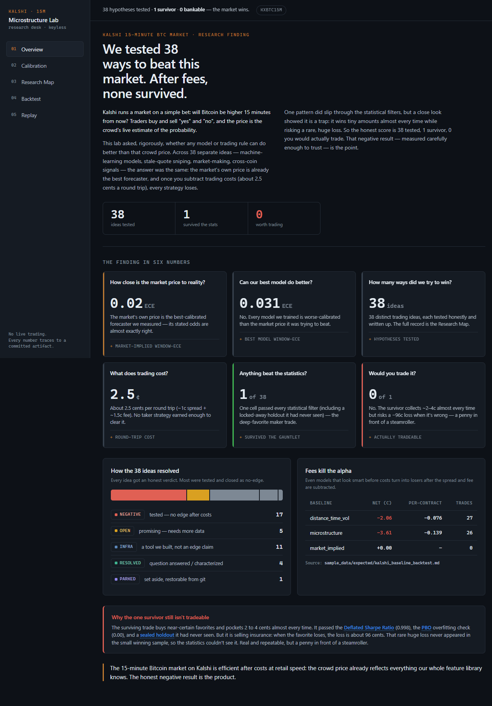
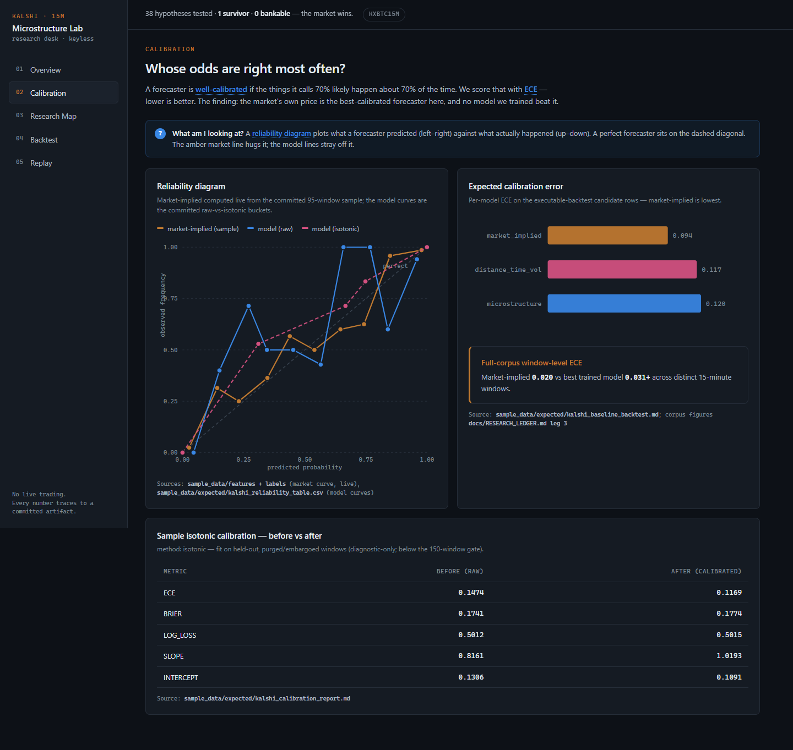
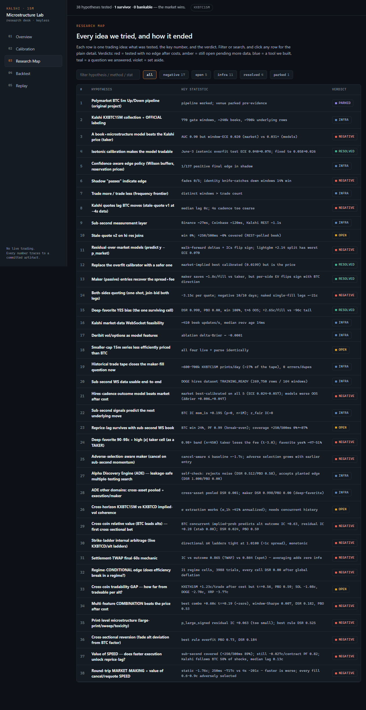
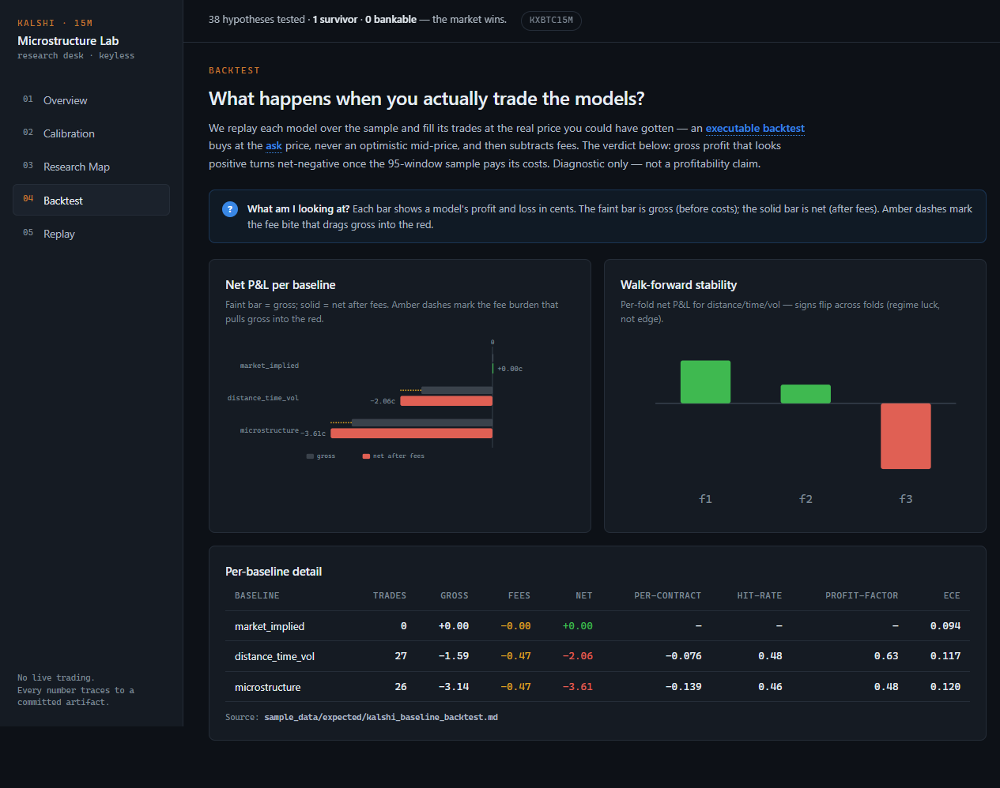
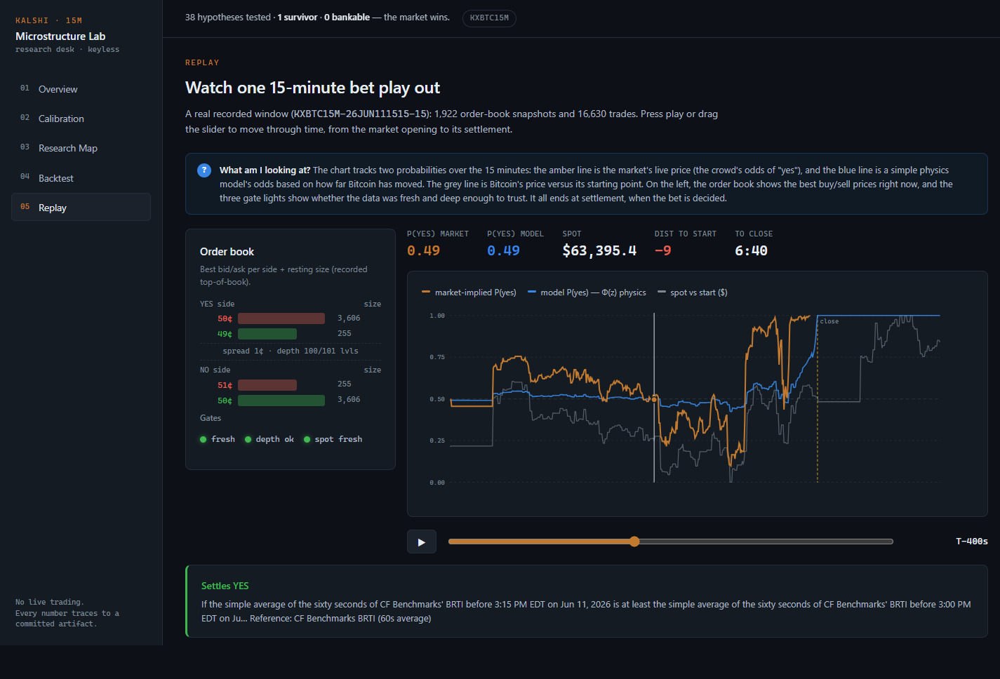

# Kalshi Microstructure Lab

A quant-research lab for short-horizon binary prediction markets. It ingests
Kalshi crypto **15-minute up/down** contracts (BTC primary, plus ETH/SOL/DOGE/XRP)
and their underlying spot/perp microstructure, builds **leakage-safe** point-in-time
features, and runs a disciplined ML pipeline — purged/embargoed cross-validation,
isotonic/Platt calibration, and **fee-aware executable backtests** — on top of an
automated **alpha-discovery engine** with false-discovery control (Deflated Sharpe
Ratio, PBO/CSCV, a sealed holdout vault). Across **38 strategy hypotheses** tested
against millions of real trade prints, it rigorously demonstrates that these markets
are **efficient after costs**. The honest negative result is the product.

> **Research only. No live trading.** The execution layer is intentionally disabled
> and unimplemented (see [below](#execution-layer-intentionally-disabled)). Nothing
> in this build can submit or cancel a real order.

> **Names:** the distribution is `kalshi-microstructure-lab`; the import package and
> CLI keep the stable short name `btc5m`. The repository folder can be renamed at
> publish time.

## Headline findings

| Question | Method | Result |
|---|---|---|
| Can any model beat the market's implied probability? | Market-implied vs distance/time/vol and microstructure logistic baselines, window-level ECE | **No.** Market-implied is the best-calibrated forecaster measured: distinct-window **ECE ≈ 0.020**, vs **0.03+** for every trained model. |
| Do taker strategies clear costs? | Direct, recalibrated, and residual-over-market models; stale-quote / reprice-lag event studies; executable ASK backtests | **No.** Every taker strategy fails to clear the ≈2.5c round cost (≈1c spread + ≈1.5c fee) out-of-sample. |
| Does market-making capture the spread? | Real-fill maker studies on 3.2M backfilled trade prints; cancel/requote latency sweeps | **No.** Static quoting is ≈−3.15c per quote; fills are adversely selected; faster quoting only gets you adversely selected faster. |
| Does automated search find a surviving edge? | 38-hypothesis alpha-discovery engine, deflated significance | **One cell survives the gauntlet** (deep-favorite maker, **DSR 0.998, PBO 0.00**, persists on the sealed holdout) — but it is short-vol favorite-capture (≈2–4c collected against a **−96c single-loss tail**). DSR is blind to the unrealized left tail, so it is **not bankable** (see caveat below). |
| Is the market inefficient in any regime? | 21 regime cells (vol/spread/depth/volume/time-of-day/IV), multi-feature combination mine | **No.** Every regime cell deflates to DSR ≈ 0. The multi-feature combination reproduces the market price almost exactly — the price sits at the information frontier of the whole feature library. |

Of the 38 legs, the large majority are **concluded-negative after costs**; a handful
are **open/watch** pending more forward data (e.g. ETH cross-coin residual, the
deep-favorite forward check), and several are **infrastructure** (measurement/safety
capability, not edge claims). The full, per-leg record with reproduction commands is
in [`docs/RESEARCH_LEDGER.md`](docs/RESEARCH_LEDGER.md).

**The one-surviving-cell caveat (important):** the deep-favorite maker cell clears the
statistical gauntlet because a 100%-win small sample contains no realized tail, not
because the tail is absent — buying a 96c favorite risks ≈96c to make ≈4c. The
Deflated Sharpe Ratio does not see that asymmetry, and the parameter-plateau/payoff
gate rejects the candidate. It is a real, out-of-sample-persistent pattern and a
penny-in-front-of-a-steamroller, not a tradeable edge.

## Why the methodology is the point

- **No look-ahead, by construction.** Features are point-in-time (`as_of_ms < close_ms`);
  training uses OFFICIAL settlement labels only; orphan labels (result but no feature
  rows) are excluded and can never inflate the gate.
- **Window-level purged CV with embargo.** Splits are over distinct, non-overlapping
  15-minute windows with a mandatory purge + embargo between segments — never row-level.
- **Executable prices, always.** Backtests fill at the executable ASK (the complement of
  the opposite side's best bid), never the midpoint, and always subtract fees, depth, and
  staleness. A hard up/down class is a diagnostic and never trades.
- **Calibration is mandatory.** Isotonic (PAV) / Platt fit on held-out windows; models are
  stamped `NON_TRADABLE_DIAGNOSTIC_ONLY` until they pass the gate *and* a calibrator.
- **False-discovery control.** The alpha-discovery engine scores per-window, deflates the
  Sharpe by the cumulative trial budget (Deflated Sharpe Ratio), estimates the Probability
  of Backtest Overfitting via CSCV, requires a parameter plateau and cross-asset
  replication, and validates survivors exactly once against a SHA-pinned sealed holdout.
  It self-checks: it rejects the in-sample best of pure noise and accepts a planted edge.
  See [`docs/ALPHA_DISCOVERY.md`](docs/ALPHA_DISCOVERY.md).

## Architecture

```
collectors (REST) ─► raw/normalized JSONL ─► point-in-time v3 feature rows ─► OFFICIAL labels
   │                                                                              │
   ├─ source-health / readiness / label-audit (orphans excluded)                 │
   ▼                                                                              ▼
model dataset (feature-backed official only, no look-ahead) ◄── purge/embargo by 15m window
   ▼
baselines (market-implied · distance/time/vol · microstructure)   [pure-stdlib; numpy/sklearn optional]
   ▼
calibration (isotonic/Platt, held-out) ─► executable backtest (ask prices, fees, depth) ─► threshold sweep
   ▼
alpha-discovery engine (feature factory → screen → search → DSR/PBO gauntlet → sealed holdout)
   ▼
paper-candidate policy (gated) ─► live-readiness scaffolding (DRY-RUN ONLY; refuses)
```

The core runs on the **standard library + PyYAML + python-dotenv**; numpy / pandas /
scikit-learn / lightgbm are optional and degrade gracefully to pure-Python models.
Full map: [`docs/ARCHITECTURE.md`](docs/ARCHITECTURE.md).

## Quickstart

```powershell
python -m venv .venv
.\.venv\Scripts\Activate.ps1              # Windows; use `source .venv/bin/activate` on POSIX
pip install -e ".[models,dev]"            # or `pip install -e .` for the stdlib-only core
copy .env.example .env                    # optional; all research paths work with the defaults

python -m btc5m.cli check-live-disabled   # safety proof: the live adapter refuses
python -m pytest -q                        # 677 offline tests, no keys / no network
```

## Zero-key demo (no API keys, no network)

A curated sample (`sample_data/`, ≈9 MB — one full BTC day of 95 OFFICIAL-labeled
15-minute windows for the reproducible demo chain, plus downsampled ETH/SOL/DOGE
windows across several days so the dashboard's calibration curves pool ~1,800 real
market-implied-vs-outcome pairs) ships in the repo so an outside reviewer can run the
full research pipeline offline. Point `DATA_DIR` at the sample and run the calibration
+ executable backtest chain on BTC (everything is correctly stamped
`NON_TRADABLE_DIAGNOSTIC_ONLY` — the sample is below the 150-window training gate by
design):

```powershell
$env:DATA_DIR    = "$PWD\sample_data"
$env:REPORTS_DIR = "$PWD\sample_reports"      # any writable output dir
$PY = ".\.venv\Scripts\python.exe"

& $PY -m btc5m.cli kalshi-build-model-dataset --series KXBTC15M --diagnostic-ok
& $PY -m btc5m.cli kalshi-data-readiness      --series KXBTC15M
& $PY -m btc5m.cli kalshi-train-baselines     --series KXBTC15M --diagnostic-only
& $PY -m btc5m.cli kalshi-calibration-report  --series KXBTC15M --diagnostic-only
& $PY -m btc5m.cli kalshi-backtest-baselines  --series KXBTC15M --diagnostic-only
```

Expected: `gate_windows: 95` (backtest gate of 60 met, training gate of 150 not — as
intended); the calibration report shows isotonic improving reliability
(**ECE 0.147 → 0.117** on this sample); the executable backtest shows every baseline
**net-negative after fees** (`distance_time_vol ≈ −2.06c`, `microstructure ≈ −3.61c`,
market-implied trades 0 by construction) — the no-edge result, in miniature. Reference
copies of the generated reports are committed under `sample_data/expected/`. Regenerated
models/datasets land in `sample_data/models/` and are gitignored.

## Interactive research dashboard

A keyless, hermetic dashboard renders the whole finding from the committed sample and
report artifacts — no API keys, no network, no live compute. Every number on screen
traces to a committed file, and the story is written in plain English for a
non-technical reader.

```powershell
pip install -e ".[dashboard]"
python -m btc5m.cli dashboard            # FastAPI on http://127.0.0.1:8791
```

Five views (progressive disclosure — the Overview answers everything in ten seconds,
the rest are drill-ins):

- **Overview** — the plain-English story ("38 ways tested, 1 survived the statistics,
  0 worth trading"), six headline tiles, the 38-leg verdict breakdown, and the
  fees-kill-alpha table.
- **Calibration** — reliability curves (market-implied computed live from the sample vs
  the committed model raw/isotonic buckets), per-model and per-coin ECE.
- **Research Map** — the 38 hypotheses as a filterable table (hypothesis → key stat →
  verdict), distilled into a machine-readable [`docs/research_ledger.json`](docs/research_ledger.json)
  and sourced back to [`docs/RESEARCH_LEDGER.md`](docs/RESEARCH_LEDGER.md).
- **Backtest** — the executable, fee-decomposed backtest (gross → fees → net) with
  walk-forward stability.
- **Replay** — a scrubbable, animated order-book replay of one real recorded 15-minute
  window (`sample_data/replay_window/`): the bid/ask ladder, spot, model vs
  market-implied probability, and the freshness/depth gates, all the way through
  settlement.

| Overview | Calibration | Research Map |
|---|---|---|
|  |  |  |

| Backtest | Replay |
|---|---|
|  |  |

## The paper

The full write-up is a proper working paper with multiple-testing control:
[`docs/PAPER.md`](docs/PAPER.md) (and a styled, self-contained
[`docs/paper.html`](docs/paper.html)) — Abstract / Market & data / Methodology
(leakage controls, purged CV + embargo, isotonic calibration, executable-fee
backtests) / Alpha-discovery protocol (DSR, PBO/CSCV, sealed holdout) / Results /
Robustness / Conclusion ("efficient after costs at retail latency") / Limitations.
Every table cites the committed report file it was computed from.

## Live pulse (keyless, read-only)

`btc5m live-pulse` reads Kalshi's **public** market-data endpoints for any currently
listed 15-minute crypto series (BTC/ETH/SOL/DOGE/XRP) and prints the implied
probability + top-of-book in the terminal. No auth, no orders. It degrades gracefully
when nothing is listed and falls back to a committed recorded fixture; `--fixture`
forces the hermetic, offline path (also the test path).

```powershell
python -m btc5m.cli live-pulse            # public read (falls back to fixture offline)
python -m btc5m.cli live-pulse --fixture  # committed recorded fixture, never touches the network
```

## Configuration

All safety-relevant defaults are safe; research paths need no credentials. Key variables
(`.env.example` documents the full surface):

| Variable | Default | Purpose |
|---|---|---|
| `TRADING_MODE` | `paper` | `offline` / `record-only` / `backtest` / `paper` (never `live` in this build) |
| `LIVE_TRADING_ENABLED` | `false` | Hard-off; live is unimplemented regardless |
| `KILL_SWITCH_ENABLED` | `true` | Rejects all orders (safe default) |
| `KALSHI_SERIES_TICKER` | `KXBTC15M` | Active series |
| `KALSHI_KEY_ID` / `KALSHI_PRIVATE_KEY_PATH` | empty | Optional; only for the read-only authenticated market-data WebSocket. Public REST needs none. The RSA key stays in a gitignored local file; it is never read or printed. |
| `DATA_DIR` / `REPORTS_DIR` | `./data` / `./reports` | Data and report roots (the demo overrides these) |
| `KALSHI_FEE_RATE` | `0.07` | Fee assumption (ASSUMED until verified against the official schedule) |
| `DERIBIT_ENABLED` | `false` | Optional volatility/options context source |

## Testing

```powershell
python -m pytest -q          # full offline suite: 677 tests, no keys, no network
```

The suite is fully offline and deterministic (≈1–2 minutes locally). CI runs `ruff`
plus a representative fast subset on every push; the **complete** suite runs in a
separate nightly workflow (`.github/workflows/nightly.yml`).

## Project structure

```
src/btc5m/
  cli.py                 ~100 subcommands (grouped below); shared arg parsing
  config.py, schemas.py, timeutils.py   shared core
  venues/kalshi/         the active system: client, orderbook, features, feature_source,
                         collector, readiness, labels_audit, model_dataset, splits,
                         train/calibrate/backtest, policy + edge_policy + uncertainty,
                         paper promotion/runtime/experiment, lock + lifecycle,
                         live_readiness (dry-run only), ops, maker_entry,
                         reprice_lag(+hires), residual_alpha, hires/ recorder
  discovery/             alpha-discovery engine (gauntlet, CPCV, holdout vault, registry,
                         feature factory, screen, search, engine)
  models/                baseline, pure_ml (stdlib ML), sklearn/lightgbm challengers
  data/ labels/ execution/ notifications/   feeds, labeling, risk + refusal adapter, alerts
tests/                   677 offline tests
sample_data/             committed zero-key demo sample (+ expected reports)
docs/                    ARCHITECTURE, MODEL_PIPELINE, ALPHA_DISCOVERY, RESEARCH_LEDGER,
                         RUNBOOK, COMMANDS, archive/
data/ reports/           local corpora (gitignored where large)
```

CLI command groups (`python -m btc5m.cli <command>`; full cheat sheet in
[`docs/COMMANDS.md`](docs/COMMANDS.md), operations in [`docs/RUNBOOK.md`](docs/RUNBOOK.md)):

- **Collection** — `kalshi-collect-continuous`, `kalshi-record`, `record-underlying`, `record-deribit`, `kalshi-backfill-settlements`, `kalshi-backfill-trades`
- **Readiness & data** — `kalshi-data-readiness`, `kalshi-label-audit`, `kalshi-build-model-dataset`, `kalshi-split-report`, `source-health`
- **Modeling** — `kalshi-train-baselines`, `kalshi-train-model`, `kalshi-calibration-report`, `kalshi-calibrate-model`
- **Backtesting** — `kalshi-backtest-baselines`, `kalshi-backtest-model`, `kalshi-threshold-sweep`, `kalshi-reprice-lag-report`
- **Alpha discovery** — `kalshi-ade-selfcheck`, `kalshi-ade-vault`, `kalshi-ade-mine[-pooled|-maker|-crosscoin|-conditional|-combo]`
- **Paper policy (never live)** — `kalshi-policy-report`, `kalshi-edge-policy-report`, `kalshi-promote-paper-artifacts`, `kalshi-paper-experiment-*`
- **Ops / monitoring (read-only)** — `kalshi-ops-status`, `kalshi-gate-progress`, `kalshi-model-health`, `kalshi-doctor`, `kalshi-eod-summary`
- **Safety** — `check-live-disabled`, `kalshi-safety-status`, `kalshi-live-blockers`

## Execution layer intentionally disabled

Live order submission is disabled by default and **unimplemented** — this is a
deliberate design stance, not a missing feature:

- The live Kalshi execution adapter's `submit()`/`cancel()` always return a structured
  refusal and issue **no HTTP** (a hard `_http_mutation` guard; tested with a `urlopen`
  call count of 0 under default config).
- `live_submission_allowed` is a hard-`False` property on every policy decision, lock
  decision, readiness config, and order intent. There is no `LIVE_CANDIDATE`,
  `SUBMITTED`, or `LIVE_FILLED` state.
- A paper candidate cannot even fire without a trained + non-diagnostic + calibrated +
  backtested model passing every freshness/depth/edge/risk gate — and the research
  concluded there is no such edge.

The full safety model is in [`docs/ARCHITECTURE.md`](docs/ARCHITECTURE.md#safety-model-live-trading-disabled-and-unimplemented).

## Roadmap & limitations (honest)

- **No demonstrated edge** — and the ledger explains why chasing more of the same data is
  a dead end. The open directions require *new inputs*: sub-second WebSocket book data,
  forward verification of the deep-favorite cell, or a structural change (cross-venue,
  different series).
- **62 GB of raw/normalized data is gitignored**, so a clean clone reproduces the
  *pipeline* (via the committed `sample_data/` demo) but not the full 3.2M-print corpus.
- **Fees are an assumption** (`KALSHI_FEE_RATE`, stamped `ASSUMED`) until verified against
  the official schedule.
- **Multi-asset series (ETH/SOL/DOGE/XRP)** are wired and collecting; comparative
  efficiency analysis is ongoing.

## License

MIT © 2026 Mason Lancellotti. See [`LICENSE`](LICENSE).
